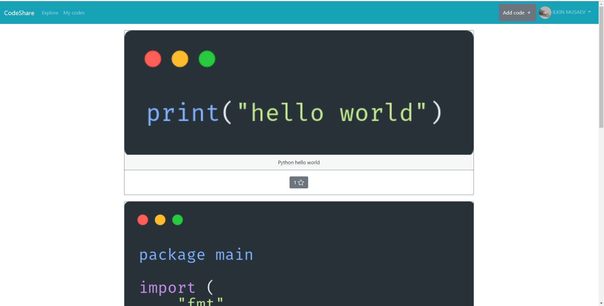

# Udacity Capstone Project - CodeShare


CodeShare is a serverless application which allows you to share small snippets of your code with the world.

The code gets converted to the image using carbon.sh service (thanks to this repo - https://github.com/MaximeHeckel/carbonara) and get stored on S3 bucket.

## Running frontend
If you want to run the frontend:
```bash
cd frontend
npm run serve
```
And then open the browser at http://localhost:8080

## Running backend
If you want to run the backend yourself:
```bash
cd backend
sls deploy
```
If will create all the nessesary resources:
- DynamoDB
- S3 bucket
- API gateway
- Lambda functions

## Authentication
Authentication is done using Auth0 service.

## API
You can find the postman collection in the root of this repo to explore the API.